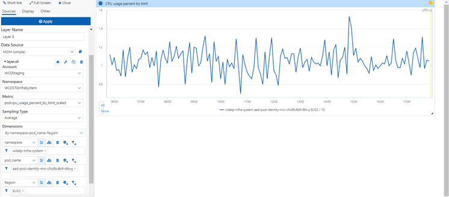

# Metrics
## Prometheus
1. Clone Microservices-Academy-Metrics repository: 
```
git clone https://github.com/DanielShor/Microservices-Academy-Metrics.git
```

2. Look at the microservices-academy-values.yaml file and put the relevant information:
```
- Geneva configuration
- ACR specification
- Key Vault URL  
```
- The values that need to be changed are wrapped in #################
- Make sure you fully understand all the values described in there, and that you read all the comments. 

3. Review carefully the Prometheus rules and alerts we've defined, and make sure you fully understand them. 
4. Install the Helm chart:
```
// run the following command when you root path is the repo's folder
helm upgrade microservices-academy-metrics --install microservices-academy-metrics  --namespace infra -f microservices-academy-metrics\microservices-academy-values.yaml
```
**Note**: This might take 1-2 minutes, since this is the first time you deploy Prometheus to your cluster, and there are few components to deploy.

5. Look at what you have created by looking at all the pods in infra namespace by running the following command:
```
kubectl get pod -n infra
```
6. Look at Prometheus UI by using the following command:
```
kubectl port-forward prometheus-microservices-academy-metr-prometheus-0 9090:9090 -n infra
```
7. Go to `http://localhost:9090/`
- Click on all the tabs and take a quick look (start from Status sub-tabs)
- Try to use some PromQL commands (using Graph tab), and look Console sub-tab, as well as graph sub-tab. For example:
```
etcd_server_has_leader{job=~".*etcd.*"} == 0
sum by(instance) (rate(node_cpu_seconds_total{mode!="idle",mode!="iowait"}[3m]))
absent(up{job="kube-scheduler"} == 1) 
```
**Note**: From the last query you should not get data, and that's because kube-scheduler is running.
- Click on Status->Rules and look for the rules we have defined
- Click on Alerts tab, and look for the alerts we have defined
  
  

## Geneva

1. Enter Geneva, go to Manage->Metrics and enter your Account name. In Namespace you can put microservices-academy (the default namespace we have configured in the Helm values). Then, in Metric you can look for the rules we have defined in Prometheus:
```
pod:cpu_usage_percent_by_limit_scaled
pod:memory_usage_percent_by_limit_scaled
```
2. Define a pre-aggregation by the following dimension (on both metrics): 
- namespace
- pod_name
- Region  
**Note**: Don't forget to save.  
For example:  
  

3. Wait for about 5 minutes, and then you can define a Dashboard based on those 2 metrics, using the pre-defined pre-aggregation.  
For example:  
  

4. You can also define monitors based on the alerting rule we defined earlier. We take MicroservicesAcademyKubePodCPUHigh critical alert as an example:
- Go back to Manage->Metrics and look for ALERTS metric.
- Recall that ALERTS is a metric which specify the alerts name, state and severity as labels (dimensions). This means that in every pre-aggregation rule we define, we must include alertname and alertstate.
- We need to define a pre-aggregation rule which is corresponding to what labels (dimensions) the alert provides. If we look at the rule `pod:cpu_usage_percent_by_limit_scaled` (which the alert is based on), we can see that the aggregation is based on `namespace` and `pod_name`. Therefore, we will pre aggregate based on those and add `Region` specification as well. Please define pre-aggregation rule as explained on section 2, by the lables (dimensions) described above:
```
- alertname
- alertstate
- severity
- namespace
- pod_name
- Region
```
- Wait for about 5 minutes, navigate to Monitor section and click on Add. 
- Click on NewMonitorId and give it a representative name (for example: MicroservicesAcademyKubePodCPUHigh):
- On Data Source section, choose the pre-aggregation you've just defined.
- We need to specify the static values, which represents the alert:
```
alertname:  MicroservicesAcademyKubePodCPUHigh
alertstate:  firing
severity: critical
```
- You can use Sum template, and the logic will be Sum of Sum. Recall that all the logic is in Prometheus. If we get an indication of an issue with specific pod for some time (which we defined in the Prometheus alerting rule), meaning, we got an alert metric to Geneva with the value 1, we should immediately raise an alert.
- You should define a Resource Type to specify in Health model, but that's on you 😊 
- The monitor should look similar to the following example:  
  
  


   
